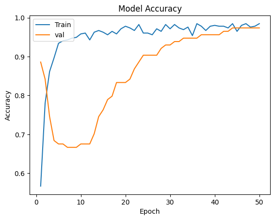
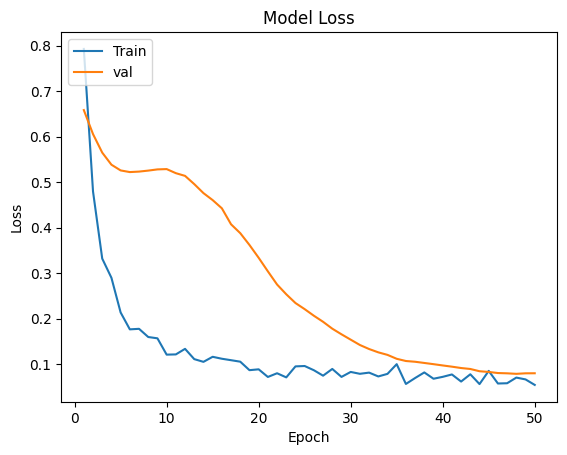

# BreastCancerDetectionWIthCNN

  <kbd>
    
  </kbd>

## Description

This project uses a convolutional neural network (CNN) to detect breast cancer. The CNN is trained on a dataset of 569 Instances, which are classified as either benign or malignant. The CNN is able to achieve an accuracy of 97% in detecting breast cancer.The CNN architecture that used is: Input Layer And Two Hidden Layers.

### Features

- It's TINY. A short README is a good README.
- List other standout qualities that'll make a potential user want to try out your project.

### Built with

- Python 
- Tensorflow
- numpy
- pandas
- matplotlib
- scikit-learn

## Getting started

### Install

Ideally, write a script whose usage is described here.

### Configure

Manual, context-specific tasks not covered in the installation process.

### Predict
  

  <kbd>
    
  </kbd>

  <kbd>
    
  </kbd>

### Acknowledgements

Thanks To All Helpers.
